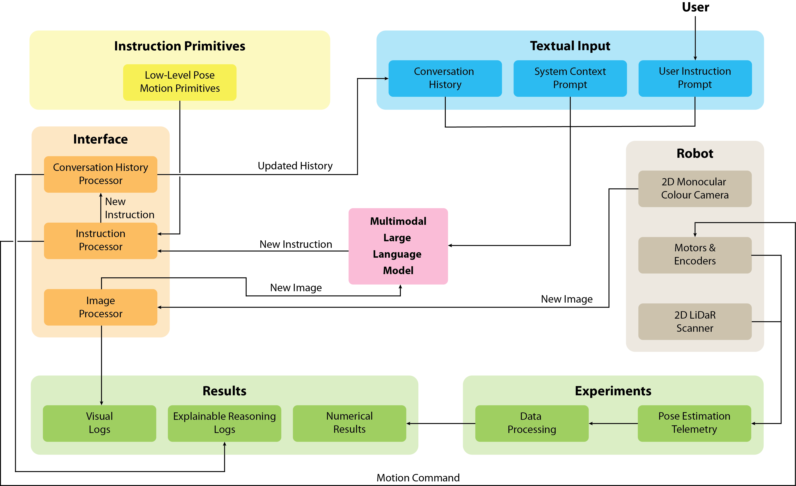

<h1>VLMs for Explainable Reactive Control of Mobile Robots</h1>

<table width="100%">
  <tr>
    <td width="60%" valign="top">

<strong>Vision-Language Model (VLM)-based reactive navigation system deployed on TurtleBot 3.</strong>

Tested in simulation and transferred to real hardware.

<h3>System Overview</h3>

Reactive vision-language navigation system deployed on TurtleBot3 (sim → real).

Given a natural language instruction and a single RGB camera frame, the VLM selects an action from a motion primitive library at each timestep. Primitives execute via closed-loop velocity control using odometry feedback, and the loop repeats with the updated visual state.

<strong>Key Features:</strong>

<ul>
  <li>Fully reactive (single-frame visual input + conversation history)</li>
  <li>Closed-loop control with discrete motion primitives</li>
  <li>Robust to odometry noise and action imprecision</li>
  <li>Identical architecture in simulation and real-world deployment</li>
  <li>Logs trajectories, images, and model dialogue for evaluation</li>
  <li>Minimises sim-to-real transfer gap via consistent system design</li>
</ul>
<h3>System Architecture</h3>

A systems-level schematic representation of the experimental setup and interface integration:

  
   
   
  
<i>(videos shown at 10x speed)</i>

    </td>
    <td width="40%" valign="top" align="center">

<strong>Simulation</strong>

  <video src="https://github.com/user-attachments/assets/097051df-f059-4c3d-b18a-9c79dcfea41c"></video>
  

<strong>Real Robot</strong>

  <video src="https://github.com/user-attachments/assets/67e36325-70ea-49c7-bf68-b36b1c3fee37"></video>
    </td>
  </tr>
</table>

<a href="../">← Main Page</a>

Copyright (c) 2026 Mark Bromley

All Rights Reserved.

